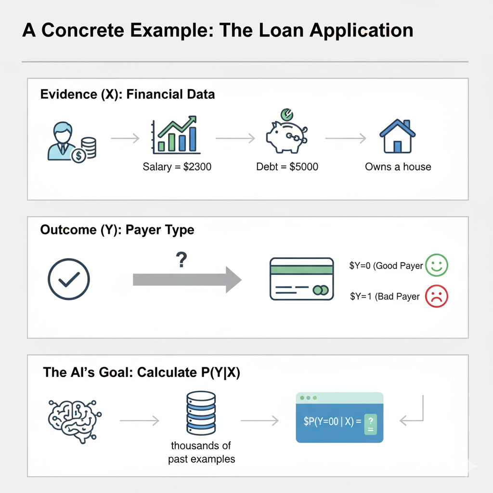
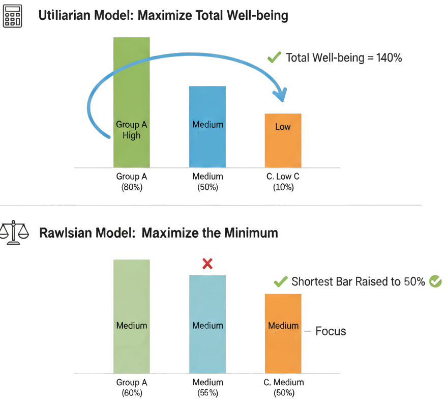

::: {.content-visible when-format="html" unless-format="revealjs"}
[Slides](slides.html){.see-all aria-label="Ver slides" title="Ver slides"}
[Lista de aulas](../index.qmd){.see-all .lesson-list-link aria-label="Lista de aulas" title="Lista de aulas"}
:::

# Revisão e Introdução: Do Dado Enviesado à Decisão que Discrimina

::: {.content-visible when-format="html" unless-format="revealjs"}

## Revisão: o que a Aula 6 deixou pronto

A Aula 6 respondeu "de onde vem o viés". Vale relembrar cada peça com o seu porquê, porque hoje construímos em cima delas.

**Os quatro espaços do dado** (Varshney, 2022, cap. 4): o dado percorre um caminho — do **construto** (o que se queria medir, no mundo ideal, sem viés) para o **observado** (o que de fato se mede) por **medição**; do observado para o **bruto** (a amostra concreta coletada) por **amostragem**; do bruto para o **preparado** (o dado final de treino/teste) por **preparação**. Cada passagem tem o seu viés: medição carrega **viés social**, amostragem carrega **viés de representação** e **temporal**, preparação carrega **viés de preparação** e **envenenamento de dados**. Nenhum desses vieses é "uma coisa ruim qualquer" — cada um ameaça uma validade específica (de construto, externa, interna), o que diz onde procurar e como corrigir.

**Proxies e quase-identificadores:** vimos que remover uma coluna sensível (ex.: raça) do dado não remove a informação — ela sobrevive em variáveis correlacionadas (CEP, histórico de utilização de saúde). A seguradora da Aula 5/6 usava custo de tratamento como proxy de gravidade de doença, e esse proxy media coisas diferentes para pacientes negros e brancos.

**A LGPD:** garante ao titular do dado acesso, correção, informação sobre os critérios usados numa decisão e revisão de decisões unicamente automatizadas (art. 20) — mas não define "discriminatório", nem cobre segurança pública, e deixa como contrapeso a auditoria da ANPD sobre a lógica da decisão, sem exigir a abertura do algoritmo em si.

## Ideia central: de "o dado está torto" para "a decisão discrimina — e isso se mede"

Até aqui, viés era um problema de **entrada**: o dado que alimenta o modelo já vem distorcido antes de qualquer treino começar. Essa é uma resposta necessária, mas incompleta — ela explica *por que* um modelo pode discriminar, não diz **o quanto** ele discrimina, nem **o que fazer** a respeito. Hoje viés vira um problema de **decisão**: dado um modelo treinado com dado imperfeito (como todo dado é), como definimos matematicamente se a decisão que ele produz é injusta? E, uma vez definida, como projetamos o modelo para perseguir justiça como objetivo — não como acidente de sorte?

::: {.callout-note}
## Roteiro de hoje

1. O que significa, em termos matemáticos e não só morais, dizer que uma decisão automatizada é "injusta"?
2. Por que simplesmente "esconder" o atributo sensível (raça, gênero) do modelo não resolve o problema?
3. Existe uma única definição correta de fairness — e, se não existe, como escolher entre elas?
4. Fairness é um ajuste que se faz depois que o modelo já está pronto, ou algo que se projeta desde o início do treino?
:::

## Problema motivador: três decisões automatizadas, três danos documentados

Três casos, cada um relatado por uma fonte jornalística ou científica independente, mostram que esse não é um problema hipotético.

**Justiça criminal — COMPAS.** Um algoritmo usado nos Estados Unidos para prever reincidência criminal foi encontrado, por uma investigação da ProPublica, com o dobro de chance de sinalizar erroneamente réus negros como "de alto risco", em comparação com réus brancos de perfil semelhante (Angwin, Larson, Mattu & Kirchner, 2016, *ProPublica*, "Machine Bias").

**Emprego — recrutador da Amazon.** Já vimos esse caso na Aula 6, do ângulo de "de onde vem o viés" (o modelo aprendeu, do histórico de contratação de dez anos numa indústria dominada por homens, a penalizar currículos com a palavra "women's"). Hoje a pergunta muda: dado que sabemos a origem do viés, como teríamos *medido*, antes de lançar a ferramenta, que ela discriminava? (Dastin, 2018, *Reuters*.)

**Saúde.** Um algoritmo amplamente usado para alocar acompanhamento clínico extra subestimou sistematicamente a necessidade de saúde dos pacientes negros mais graves, levando milhões de pacientes a receberem menos cuidado do que pacientes brancos igualmente doentes (Obermeyer, Powers, Vogeli & Mullainathan, 2019, *Science*, "Dissecting racial bias in an algorithm used to manage the health of populations").

Nos três casos, ninguém escreveu no código "discrimine por raça" ou "discrimine por gênero". Os modelos aprenderam, com correção estatística, os padrões do dado que receberam — exatamente o mecanismo que a Aula 6 já descreveu. A pergunta de hoje: **como alguém, antes de soltar esses sistemas em produção, poderia ter *medido* essa injustiça e *decidido* agir sobre ela?**

:::

::: {.content-visible when-format="revealjs"}

## Do Dado Enviesado à Decisão que Discrimina

::: {.fragment}
**Aula 6, em três peças:**
:::

::: {.fragment}
**1.** Quatro espaços do dado (construto → observado → bruto → preparado), cada passagem com o seu viés.
:::

::: {.fragment}
**2.** Proxies **reconstroem** o atributo sensível removido — cegueira de atributo não resolve.
:::

::: {.fragment}
**3.** LGPD garante acesso, correção e revisão — mas não define "discriminatório".
:::

## Ideia Central

::: {.fragment}
Até aqui: viés é um problema de **entrada** — o dado já vem torto.
:::

::: {.fragment .callout-tip icon=false}
Isso explica **por que** um modelo discrimina — não diz **o quanto**, nem **o que fazer**.
:::

::: {.fragment}
**Hoje:** viés vira um problema de **decisão** — algo que se **mede** e se **projeta contra**, não um acidente de sorte.
:::

## O Roteiro de Hoje

::: {.fragment}
1. O que significa, matematicamente, dizer que uma decisão é "injusta"?
:::
::: {.fragment}
2. Por que "esconder" o atributo sensível não resolve?
:::
::: {.fragment}
3. Existe **uma única** definição correta de fairness?
:::
::: {.fragment}
4. Fairness é ajuste depois de pronto, ou objetivo desde o início do treino?
:::

## Três Decisões, Três Danos

::: {.fragment}
**COMPAS (justiça criminal):** réus negros com o **dobro** de chance de serem erroneamente marcados "alto risco" (ProPublica, 2016).
:::

::: {.fragment}
**Recrutador Amazon (emprego):** já visto na Aula 6 — hoje: como **medir** o viés *antes* de lançar? (Reuters, 2018)
:::

::: {.fragment .callout-warning icon=false}
**Saúde:** algoritmo de alocação de cuidado subestimou sistematicamente pacientes negros mais graves — milhões receberam menos cuidado que pacientes brancos igualmente doentes (*Science*, 2019).
:::

::: {.fragment}
Ninguém escreveu "discrimine por raça" no código. **Como medir isso antes de soltar o sistema em produção?**
:::

## Pergunta
:::

::: {.callout-tip}
## Ninguém programou para discriminar — e agora?

Nos três casos de abertura (COMPAS, Amazon, saúde), o modelo aprendeu o padrão discriminatório do próprio dado histórico, sem que ninguém tivesse escrito uma regra explícita de discriminação. Antes de qualquer definição formal de fairness, pense: se dois times de engenharia, um em cada empresa, tivessem *querido* checar isso antes do lançamento, o que precisariam ter comparado — e entre quem?

**Dica:** pense em o que precisa ser mantido igual, e para quais grupos, para que uma comparação faça sentido.

- □ Bastaria comparar a acurácia geral do modelo entre o grupo privilegiado e o não privilegiado; se as duas acurácias forem parecidas, o modelo não discrimina.
- □ É preciso comparar, entre os grupos, alguma medida do resultado da decisão (quem é aprovado, quem é sinalizado como risco, quem recebe o recurso) — acurácia geral sozinha pode escapar de repartir o erro de forma desigual.
- □ Se o time descobrir uma diferença de tratamento entre os grupos, essa diferença já basta, sozinha, para provar que o modelo é injusto, sem mais nenhuma outra consideração.
- □ Essa checagem só é necessária uma vez, antes do lançamento — depois de aprovado, o modelo pode ser considerado justo permanentemente, mesmo enquanto novos dados chegam.
:::

::: {.content-visible when-format="revealjs"}

## V/F — Ninguém Programou Para Discriminar — Resposta

::: {.callout-tip icon=false}
- ✗ Falso — acurácia geral pode esconder um erro concentrado num grupo (o caso da Aula 6: 99% de acurácia geral, 100% de erro num grupo minoritário).
- ✔ Verdadeiro — é exatamente o que o resto da aula formaliza: comparar uma medida do *resultado* da decisão entre grupos definidos por um atributo sensível.
- ✗ Falso — o Bloco 4 mostra que existem várias métricas de injustiça, cada uma capturando uma noção diferente; uma diferença pode violar uma métrica e não outra, e a escolha de qual métrica importa é, ela mesma, uma decisão ética.
- ✗ Falso — o Bloco 6 mostra que fairness estática, medida uma vez, não é suficiente: decisões de hoje mudam o dado de amanhã.
:::

::: {.fragment}
**Seguindo:** para comparar "o resultado da decisão entre grupos" com precisão, precisamos primeiro entender como a máquina chega a essa decisão.
:::

:::

# Intuição: Como uma Máquina "Aprende" uma Decisão

::: {.content-visible when-format="html" unless-format="revealjs"}

Antes de formalizar injustiça, precisamos de um vocabulário mínimo para *como* um modelo decide — sem isso, "a máquina discrimina" fica uma acusação vaga demais para atacar matematicamente.

No fundo, aprendizado de máquina é o processo de achar o modelo que melhor explica um conjunto de dados observado. Formalmente, buscamos o modelo $f$ que maximiza a probabilidade de termos observado os dados $X$ que de fato observamos:

$$\max_{f} \; P_f(X)$$

Esse é o **princípio da máxima verossimilhança**: entre todos os modelos possíveis, escolhemos aquele que torna os dados observados os mais prováveis. Na maioria das aplicações — incluindo os três casos da Abertura — não queremos só descrever o dado $X$: queremos **prever um resultado específico** $Y$ a partir de uma evidência $X$. O objetivo então se torna calcular a probabilidade condicional:

$$\max_{f} \; P_f(Y \mid X)$$

Isso não é uma afirmação de certeza — $f(X)$ é o melhor palpite informado sobre o valor de $Y$, calibrado pela frequência com que padrões parecidos a $X$, no dado de treino, estiveram associados a cada valor de $Y$.

**Exemplo-fio: o pedido de empréstimo.** Considere um banco decidindo se aprova um crédito.

- **Evidência ($X$):** os dados financeiros da pessoa — salário (R\$ 2.300), dívida (R\$ 5.000), se possui imóvel.
- **Resultado ($Y$):** se a pessoa será um bom pagador ($Y=0$) ou um mau pagador ($Y=1$).
- **O objetivo da IA:** aprender, a partir de milhares de casos passados, a calcular com precisão $P(Y=0 \mid X)$ — a probabilidade de bom pagamento dado o perfil financeiro.

::: {.fig-resize style="width: 60%; margin: 0 auto;"}

:::

Este é o mesmo motor por trás dos três casos da Abertura: o COMPAS calcula $P(\text{reincidência} \mid \text{histórico criminal, idade, ...})$; o recrutador da Amazon calculava $P(\text{bom contratado} \mid \text{currículo})$; o algoritmo de saúde calculava $P(\text{necessidade alta} \mid \text{custo histórico de tratamento})$. Em nenhum desses três, até aqui, apareceu nenhum atributo sensível — é exatamente aí que o próximo bloco entra.

:::

::: {.content-visible when-format="revealjs"}

## O Motor Comum: Máxima Verossimilhança

::: {.fragment}
Aprendizado de máquina: achar o modelo $f$ que torna o dado observado $X$ **o mais provável**.
:::

::: {.fragment .callout-tip icon=false}
$$\max_{f} \; P_f(X)$$
:::

::: {.fragment}
Para **prever** um resultado $Y$ a partir de uma evidência $X$:
:::

::: {.fragment .callout-tip icon=false}
$$\max_{f} \; P_f(Y \mid X)$$
:::

::: {.fragment}
Não é certeza — é o **melhor palpite informado**, calibrado pela frequência do padrão no dado de treino.
:::

## Exemplo-Fio: o Empréstimo

::::: {.columns}

:::: {.column width="55%"}
::: {.fragment}
**Evidência ($X$):** salário (R\$ 2.300), dívida (R\$ 5.000), posse de imóvel.
:::

::: {.fragment}
**Resultado ($Y$):** bom pagador ($Y{=}0$) ou mau pagador ($Y{=}1$).
:::

::: {.fragment .callout-tip icon=false}
Objetivo: aprender a calcular $P(Y{=}0 \mid X)$ com precisão, a partir de casos passados.
:::

::: {.fragment}
**Mesmo motor** dos três casos da Abertura: 

- COMPAS calcula $P(\text{reincidência}\mid \cdot)$; 
- Amazon calculava $P(\text{bom contratado}\mid \cdot)$; 
- saúde calculava $P(\text{necessidade alta}\mid \cdot)$. 

**Nenhum atributo sensível apareceu — ainda.**
:::

::::

:::: {.column width="45%"}
::: {.fig-resize style="width: 100%; margin: 0 auto;"}

:::
::::

:::::

:::

# O Dado Sensível $Z$ e a Falha da "Cegueira Deliberada"

::: {.content-visible when-format="html" unless-format="revealjs"}

E se a evidência $X$ incluir mais do que dado financeiro? Na prática, os conjuntos de dados que alimentam esses modelos frequentemente têm, entre suas colunas (ou entre variáveis fortemente correlacionadas a elas), informação sobre **atributos sensíveis** — raça, gênero, idade, entre outros. Chamamos esse atributo de $Z$: informação que, por princípio ético e/ou legal, **não deveria** determinar o resultado de uma decisão.

**O problema:** para o modelo, $Z$ não é diferente de qualquer outra coluna do dado. O algoritmo de máxima verossimilhança não tem noção prévia de que $Z$ é "proibido" — ele usa qualquer padrão estatístico que melhore sua previsão, inclusive um padrão baseado em $Z$, se esse padrão existir no dado de treino.

A reação intuitiva é simples: **tirar $Z$ do conjunto de treino**. Se o modelo nunca vê a coluna "raça", como ele poderia discriminar por raça? Essa estratégia — chamada de *fairness through unawareness* ("justiça pela ignorância") — **falha sistematicamente**. Mesmo removendo $Z$ explicitamente, o modelo frequentemente consegue **reconstruir** essa informação a partir de outras variáveis correlacionadas a ela — os **proxies**, já vistos na Aula 6 (CEP como proxy de raça e classe social; sobrenome como proxy de origem étnica; histórico de utilização de saúde como proxy de raça, no caso da seguradora).

::: {.callout-important}
## A falha da cegueira de atributo (Raimundo, 2025, tradução livre)

> "Mesmo que removamos explicitamente $Z$ do dado, o modelo frequentemente consegue reconstruí-lo a partir de outras variáveis correlacionadas (proxies, como o CEP, por exemplo). Isso é conhecido como a falha da 'justiça pela ignorância' (*fairness through unawareness*)."
:::

Isso deixa claro que **não dá para resolver fairness escondendo a informação** — a informação sensível já está espalhada, de forma redundante, por todo o resto do dado. Se cegueira não funciona, a alternativa é o oposto: **definir explicitamente**, em termos matemáticos, o que significa uma decisão ser justa em relação a $Z$ — e é isso que o próximo bloco faz.

:::

::: {.content-visible when-format="revealjs"}

## O Atributo Sensível $Z$

::: {.fragment}
Dado real frequentemente carrega, entre suas colunas (ou entre proxies), um **atributo sensível $Z$** — raça, gênero, idade.
:::

::: {.fragment .callout-warning icon=false}
Para o modelo, $Z$ é só mais uma coluna — ele usa qualquer padrão que melhore a previsão, **inclusive um baseado em $Z$**.
:::

## "Justiça Pela Ignorância" — e Por Que Falha

::: {.fragment}
**Reação intuitiva:** tirar $Z$ do dado de treino. Sem a coluna "raça", como discriminar por raça?
:::

::: {.fragment .callout-warning icon=false}
## Parcialidade mesmo desconhecendo
"Mesmo removendo $Z$ explicitamente, o modelo frequentemente consegue **reconstruí-lo** a partir de variáveis correlacionadas (proxies, como o CEP)."
:::

::: {.fragment}
**Já visto na Aula 6:** CEP como proxy de raça/classe; histórico de utilização de saúde como proxy de raça (caso da seguradora).
:::

::: {.fragment .callout-tip icon=false}
Se cegueira não resolve, a saída é o oposto: **definir explicitamente**, em matemática, o que é uma decisão justa em relação a $Z$.
:::

## Pergunta
:::

::: {.callout-tip}
## Por que tirar a coluna não basta?

Uma fintech decide remover a coluna "gênero" do seu modelo de concessão de crédito, para evitar discriminação. Meses depois, uma auditoria interna encontra uma disparidade de aprovação entre clientes que se identificam como homens e mulheres, mesmo sem a coluna "gênero" ter sido usada em nenhum momento do treino. Avalie as afirmações sobre esse cenário.

**Dica:** pense em quais outras colunas do dado de uma fintech (profissão, histórico de consumo, tipo de plano de celular, por exemplo) podem estar correlacionadas com gênero, mesmo sem ser gênero.

- □ A auditoria só poderia ter encontrado essa disparidade por erro de cálculo, já que é matematicamente impossível discriminar por um atributo que nunca esteve no dado de treino.
- □ É plausível que outras colunas do dado (profissão, categoria de gasto, tipo de estabelecimento frequentado) funcionem como proxies de gênero, permitindo que o modelo reconstrua esse padrão indiretamente.
- □ Se a fintech também removesse todas as colunas fortemente correlacionadas com gênero, uma de cada vez, até não sobrar nenhuma correlação individual forte, isso garantiria matematicamente que a disparidade desapareceria.
- □ Essa mesma falha se aplicaria a um modelo de triagem de currículos que removesse a coluna "nome", mas mantivesse a coluna "instituição de ensino", numa sociedade em que o acesso a diferentes instituições é desigual entre grupos.
:::

::: {.content-visible when-format="revealjs"}

## V/F — Por Que Tirar a Coluna Não Basta — Resposta

::: {.callout-tip icon=false}
- ✗ Falso — é exatamente o mecanismo descrito na aula: proxies reconstroem a informação removida, sem erro de cálculo nenhum envolvido.
- ✔ Verdadeiro — esse é o mecanismo da falha de "justiça pela ignorância": informação sensível sobrevive, espalhada, em variáveis correlacionadas.
- ✗ Falso — remover proxies individuais não garante a remoção de padrões que emergem de **combinações** de variáveis, cada uma fracamente correlacionada com $Z$ sozinha, mas conjuntamente informativas.
- ✔ Verdadeiro — mesmo mecanismo de proxy: a instituição de ensino carrega, de forma correlacionada, informação sobre origem socioeconômica e, indiretamente, sobre atributos sensíveis distribuídos de forma desigual entre instituições.
:::

::: {.fragment}
**Seguindo:** se cegueira não resolve, como definimos, com uma fórmula, o que é (in)justiça?
:::

:::

# Definindo (In)Justiça com Probabilidade: as Muitas Faces do Fairness

::: {.content-visible when-format="html" unless-format="revealjs"}

Com o vocabulário de $X$, $Y$, $Z$ e $P_f(Y\mid X)$ em mãos, já podemos escrever definições matemáticas precisas de injustiça — não mais uma intuição solta, mas uma desigualdade que pode ser calculada e testada sobre qualquer modelo.

## Injustiça individual

A forma mais direta de escrever discriminação é comparar a decisão do modelo para o **mesmo perfil financeiro** $X$, variando só o atributo sensível $Z$:

$$P(Y=0 \mid X, Z=\text{branca}) > P(Y=0 \mid X, Z=\text{negra})$$

Em português: a probabilidade de ser considerado "bom pagador" é maior para um grupo do que para outro, **mesmo com exatamente o mesmo perfil financeiro** $X$. Essa desigualdade é a assinatura matemática da discriminação — se ela vale para um indivíduo específico, dizemos que há **injustiça individual** contra ele.

## Injustiça de grupo (disparidade de utilidade)

Olhar indivíduo a indivíduo não escala para auditar um sistema inteiro — por isso a literatura de fairness também define uma versão agregada, por **grupo**. Definimos a utilidade $U$ como o benefício (ou dano) que uma decisão $A_t$ produz para uma pessoa no tempo $t$, dado seu resultado real $Y_t$. A **disparidade de utilidade entre grupos** é:

$$\Delta = \left| \mathbb{E}[U(Y_t, A_t) \mid Z=0] - \mathbb{E}[U(Y_t, A_t) \mid Z=1] \right|$$

Em português: $\Delta$ mede a diferença entre o benefício médio que cada grupo recebe das decisões do modelo, ao longo do tempo. Quanto maior $\Delta$, maior a disparidade — mas, diferente da injustiça individual, essa métrica não compara pessoa a pessoa, compara **médias populacionais**.

## Duas métricas de grupo concorrentes: Paridade Demográfica e Igualdade de Oportunidade

A disparidade de utilidade é genérica — na prática, a literatura de fairness propõe métricas mais específicas, cada uma capturando uma noção diferente de "grupo tratado igualmente". Duas das mais usadas:

**Paridade Demográfica:** as taxas de aprovação devem ser iguais entre os grupos, sem olhar para se a pessoa realmente estava qualificada:

$$P(\hat{Y}=0 \mid Z=\text{branca}) = P(\hat{Y}=0 \mid Z=\text{negra})$$

*Crítica:* essa métrica ignora se os indivíduos aprovados de fato mereciam ser aprovados — ela poderia ser satisfeita aprovando pessoas não qualificadas de um grupo só para igualar a taxa, o que também é uma forma de tratamento desigual.

**Igualdade de Oportunidade:** entre as pessoas **de fato qualificadas** ($Y=1$), a chance de aprovação deve ser igual entre os grupos:

$$P(\hat{Y}=0 \mid Y=1, Z=\text{branca}) = P(\hat{Y}=0 \mid Y=1, Z=\text{negra})$$

*Crítica:* essa métrica não diz nada sobre como as pessoas **não qualificadas** de cada grupo são tratadas — um modelo pode satisfazer Igualdade de Oportunidade e ainda assim recusar pessoas não qualificadas de um grupo com taxas de falso positivo bem diferentes das do outro grupo.

## O Teorema da Impossibilidade

A Figura a seguir resume o conflito: as duas métricas partem de perguntas diferentes ("todo mundo tem a mesma taxa de aprovação?" vs. "entre quem merece, a taxa é igual?") e, em geral, **não podem ser satisfeitas ao mesmo tempo** pelo mesmo modelo, a menos que a taxa de qualificação real já seja igual entre os grupos de partida (um caso raro na prática, quando o próprio $Y$ tem distribuição desigual entre grupos por razões históricas — como visto na Aula 6).

::: {.fig-resize style="width: 100%; margin: 0 auto;"}
```{.tikz}
\definecolor{dpfill}{RGB}{219,234,254}
\definecolor{dpborder}{RGB}{0,133,202}
\definecolor{eofill}{RGB}{253,224,220}
\definecolor{eoborder}{RGB}{224,60,49}
\definecolor{impfill}{RGB}{255,236,214}
\definecolor{impborder}{RGB}{217,83,30}

\begin{tikzpicture}[
  crit/.style={rectangle, rounded corners=6pt, line width=1.2pt, text=black, minimum width=6.6cm, minimum height=2.4cm, align=center, font=\scriptsize},
  imp/.style={rectangle, rounded corners=4pt, fill=impfill, draw=impborder, line width=1.2pt, text=black, text width=9.5cm, minimum height=1.9cm, align=center, font=\scriptsize},
  arr/.style={draw=black!65, thick, ->, >=stealth}
]

\node[crit, fill=dpfill, draw=dpborder] (DP) at (0,3.2) {\textbf{Paridade Demográfica}\\ $P(\hat{Y}{=}1\mid Z{=}\text{branca})$\\ $= P(\hat{Y}{=}1\mid Z{=}\text{negra})$\\ \textit{``todo mundo tem a mesma taxa?''}};
\node[crit, fill=eofill, draw=eoborder] (EO) at (8.6,3.2) {\textbf{Igualdade de Oportunidade}\\ $P(\hat{Y}{=}1\mid Y{=}1, Z{=}\text{branca})$\\ $= P(\hat{Y}{=}1\mid Y{=}1, Z{=}\text{negra})$\\ \textit{``entre quem merece, é igual?''}};

\node[font=\Large\bfseries, text=impborder] (X) at (4.3,3.2) {$\neq$};

\node[imp] (T) at (4.3,0.2) {\textbf{Teorema da Impossibilidade}\\ Exceto em casos muito restritos, não é possível satisfazer todas as métricas de fairness ao mesmo tempo — escolher uma é uma decisão \textbf{ética}, não só técnica};

\draw[arr, draw=dpborder!70] (DP.south) -- (2.1,1.15);
\draw[arr, draw=eoborder!70] (EO.south) -- (6.5,1.15);

\end{tikzpicture}
```
:::

Esse resultado é conhecido, na literatura de fairness algorítmica, como o **Teorema da Impossibilidade**: fora de casos muito restritos, é matematicamente impossível satisfazer todas as métricas de fairness relevantes simultaneamente. A consequência prática é desconfortável, mas central para esta disciplina: **escolher qual métrica perseguir é uma escolha de valores, não um detalhe técnico neutro** — a mesma tese, de que decisões "técnicas" carregam consequência ética, que atravessa toda a disciplina desde a Aula 1.

:::

::: {.content-visible when-format="revealjs"}

## Injustiça Individual

::: {.fragment .callout-tip icon=false}
$$P(Y{=}0 \mid X, Z{=}\text{branca}) > P(Y{=}0 \mid X, Z{=}\text{negra})$$
:::

::: {.fragment}
**Mesmo perfil financeiro $X$**, resultado diferente conforme $Z$ — a assinatura matemática da discriminação.
:::

## Injustiça de Grupo: Disparidade de Utilidade

::: {.fragment}
Não escala olhar pessoa a pessoa — versão agregada por **grupo**, com utilidade $U$ (benefício/dano de uma decisão):
:::

::: {.fragment .callout-tip icon=false}
$$\Delta = \left| \mathbb{E}[U(Y_t, A_t) \mid Z{=}0] - \mathbb{E}[U(Y_t, A_t) \mid Z{=}1] \right|$$
:::

::: {.fragment}
Diferença entre o benefício **médio** que cada grupo recebe — compara populações, não indivíduos.
:::

## Paridade Demográfica

::: {.fragment .callout-tip icon=false}
$$P(\hat{Y}{=}0 \mid Z{=}\text{branca}) = P(\hat{Y}{=}0 \mid Z{=}\text{negra})$$
:::

::: {.fragment}
Taxas de aprovação **iguais** entre grupos — sem checar qualificação real.
:::

::: {.fragment .callout-warning icon=false}
**Crítica:** ignora se quem foi aprovado de fato merecia.
:::

## Igualdade de Oportunidade

::: {.fragment .callout-tip icon=false}
$$P(\hat{Y}{=}0 \mid Y{=}1, Z{=}\text{branca}) = P(\hat{Y}{=}0 \mid Y{=}1, Z{=}\text{negra})$$
:::

::: {.fragment}
Entre **quem de fato é qualificado**, a chance de aprovação deve ser igual.
:::

::: {.fragment .callout-warning icon=false}
**Crítica:** nada diz sobre como os **não qualificados** de cada grupo são tratados.
:::

## O Teorema da Impossibilidade

::: {.fig-resize style="width: 100%; margin: 0 auto;"}
```{.tikz}
\definecolor{dpfill}{RGB}{219,234,254}
\definecolor{dpborder}{RGB}{0,133,202}
\definecolor{eofill}{RGB}{253,224,220}
\definecolor{eoborder}{RGB}{224,60,49}
\definecolor{impfill}{RGB}{255,236,214}
\definecolor{impborder}{RGB}{217,83,30}

\begin{tikzpicture}[
  crit/.style={rectangle, rounded corners=6pt, line width=1.2pt, text=black, minimum width=6.6cm, minimum height=2.4cm, align=center, font=\scriptsize},
  imp/.style={rectangle, rounded corners=4pt, fill=impfill, draw=impborder, line width=1.2pt, text=black, text width=9.5cm, minimum height=1.9cm, align=center, font=\scriptsize},
  arr/.style={draw=black!65, thick, ->, >=stealth}
]

\node[crit, fill=dpfill, draw=dpborder] (DP) at (0,3.2) {\textbf{Paridade Demográfica}\\ $P(\hat{Y}{=}1\mid Z{=}\text{branca})$\\ $= P(\hat{Y}{=}1\mid Z{=}\text{negra})$\\ \textit{``todo mundo tem a mesma taxa?''}};
\node[crit, fill=eofill, draw=eoborder] (EO) at (8.6,3.2) {\textbf{Igualdade de Oportunidade}\\ $P(\hat{Y}{=}1\mid Y{=}1, Z{=}\text{branca})$\\ $= P(\hat{Y}{=}1\mid Y{=}1, Z{=}\text{negra})$\\ \textit{``entre quem merece, é igual?''}};

\node[font=\Large\bfseries, text=impborder] (X) at (4.3,3.2) {$\neq$};

\node[imp] (T) at (4.3,0.2) {\textbf{Teorema da Impossibilidade}\\ Exceto em casos muito restritos, não é possível satisfazer todas as métricas de fairness ao mesmo tempo — escolher uma é uma decisão \textbf{ética}, não só técnica};

\draw[arr, draw=dpborder!70] (DP.south) -- (2.1,1.15);
\draw[arr, draw=eoborder!70] (EO.south) -- (6.5,1.15);

\end{tikzpicture}
```
:::

::: {.fragment .callout-tip icon=false}
Escolher a métrica é uma decisão de **valores**, não um detalhe técnico neutro — mesma tese da Aula 1, aplicada aqui.
:::

## Pergunta
:::

::: {.callout-tip}
## Duas métricas, dois resultados diferentes

Um sistema de admissão universitária seleciona candidatos por nota de corte. Historicamente, o grupo A teve menos acesso a preparação de qualidade do que o grupo B, então uma fração menor do grupo A chega "qualificada" ($Y=1$) segundo os critérios da prova. A universidade tem duas opções de desenho do sistema: (i) ajustar a nota de corte para que a taxa de aprovação final seja igual entre os grupos A e B; (ii) manter a nota de corte única, mas garantir que, entre os candidatos realmente qualificados de cada grupo, a chance de aprovação seja igual.

**Dica:** relacione cada opção com uma das duas métricas definidas acima, e pense no que cada uma faz com candidatos não qualificados.

- □ A opção (i) implementa Paridade Demográfica, e a opção (ii) implementa Igualdade de Oportunidade.
- □ As duas opções, (i) e (ii), são matematicamente equivalentes sempre que a nota de corte é a mesma para os dois grupos.
- □ Se o grupo A tem uma fração menor de candidatos qualificados do que o grupo B, a opção (i) exigirá, para igualar as taxas de aprovação, aprovar uma fração maior de candidatos não qualificados do grupo A do que do grupo B.
- □ A opção (ii), por si só, garante automaticamente que os candidatos não qualificados de ambos os grupos sejam reprovados nas mesmas taxas.
:::

::: {.content-visible when-format="revealjs"}

## V/F — Duas Métricas, Dois Resultados — Resposta

::: {.callout-tip icon=false}
- ✔ Verdadeiro — (i) iguala taxas de aprovação totais (Paridade Demográfica); (ii) iguala a chance de aprovação só entre qualificados (Igualdade de Oportunidade).
- ✗ Falso — são equivalentes só no caso particular em que a fração de qualificados já é igual entre os grupos; quando as taxas de qualificação real diferem (como no enunciado), as duas opções produzem resultados diferentes.
- ✔ Verdadeiro — é exatamente a crítica formal à Paridade Demográfica: para igualar a taxa total quando a qualificação real difere, o sistema precisa compensar aprovando não qualificados do grupo com menos qualificados.
- ✗ Falso — Igualdade de Oportunidade só controla o tratamento de quem **é** qualificado; não impõe nada sobre a taxa de falso positivo entre não qualificados de cada grupo, que pode continuar desigual.
:::

::: {.fragment}
**Seguindo:** se toda métrica estática tem um limite, existe uma forma diferente de perseguir fairness — não igualando, mas **melhorando o pior caso**.
:::

:::

# Fairness Rawlsiana: Melhorando a Vida de Quem Está Pior

::: {.content-visible when-format="html" unless-format="revealjs"}

As métricas do bloco anterior comparam grupos entre si — igualar taxas, igualar oportunidades. Existe uma abordagem diferente, que não parte de "igualar", mas de **melhorar o resultado do grupo em pior situação**, mesmo que isso não produza igualdade perfeita entre todos.

A inspiração vem do filósofo político **John Rawls** e do seu "Princípio da Diferença", um dos pilares de sua teoria de justiça:

::::: {.columns}

:::: {.column width="78%"}
::: {.callout-important}
## O Princípio da Diferença (Rawls, citado em Raimundo, 2025, tradução livre)

> "Desigualdades sociais e econômicas devem ser organizadas de modo que sejam... para o maior benefício dos membros menos favorecidos da sociedade."
:::
::::

:::: {.column width="22%"}
::: {.fig-resize style="width: 100%; margin: 0 auto;"}

:::
::::

:::::

Traduzindo esse princípio para a linguagem de aprendizado de máquina: em vez de igualar o resultado entre grupos, **maximizamos a utilidade esperada do grupo que está em pior situação**:

$$\max_{f} \; \left( \min_{z} \; \mathbb{E}[U \mid Z=z] \right)$$

Lendo a fórmula de dentro para fora: para cada grupo $z$ (ex.: $Z=\text{branca}$, $Z=\text{negra}$), calculamos a utilidade esperada $\mathbb{E}[U\mid Z=z]$ que o modelo entrega a esse grupo. O termo $\min_z$ identifica o **pior grupo** — aquele que recebe menos benefício do modelo atual. O termo $\max_f$ então escolhe, entre todos os modelos possíveis $f$, aquele que **maximiza** essa utilidade mínima. Ou seja: constrói-se o modelo que é o melhor possível **para quem está pior**, não o modelo que iguala médias.

A diferença fica clara comparando lado a lado o objetivo utilitarista clássico (maximizar o bem-estar total, mesmo que isso signifique deixar um grupo bem atrás dos outros) com o objetivo Rawlsiano (elevar especificamente o grupo pior servido, mesmo sem maximizar a soma):

::: {.fig-resize style="width: 55%; margin: 0 auto;"}

:::

Essa não é só uma proposta filosófica — é um objetivo de otimização que pode ser resolvido computacionalmente. O framework **M²FGB** (Pereira, Valdrighi & Raimundo, 2025, publicado na *ACM Conference on Fairness, Accountability, and Transparency*), desenvolvido no próprio Instituto de Computação da UNICAMP, implementa exatamente esse objetivo *maximin* dentro de *gradient boosting* — o mesmo tipo de modelo usado em muitas aplicações reais de crédito e risco:

::: {.callout-note}
## M²FGB (Pereira, Valdrighi & Raimundo, 2025, tradução livre do resumo)

> "Consideramos aplicar conceitos de justiça de subgrupo a máquinas de gradient boosting [...] Nossa abordagem expandiu as metodologias de gradient boosting para explorar uma gama mais ampla de funções objetivo, que combinam perdas convencionais [...] e um termo de fairness min-max."
:::

Nota de autoria explícita: este é trabalho do próprio grupo de pesquisa do professor desta disciplina, não uma citação de terceiros — a mesma convenção de autenticidade já usada na Aula 6 com o artigo de Nascimento & Raimundo.

:::

::: {.content-visible when-format="revealjs"}

## Uma Alternativa a "Igualar": Melhorar o Pior Caso

::::: {.columns}

:::: {.column width="72%"}
::: {.fragment}
Em vez de igualar grupos, **melhorar o resultado de quem está em pior situação** — mesmo sem igualdade perfeita.
:::

::: {.fragment .callout-tip icon=false}
**Princípio da Diferença (Rawls):** "desigualdades [...] para o maior benefício dos membros menos favorecidos da sociedade."
:::
::::

:::: {.column width="28%"}
::: {.fig-resize style="width: 100%; margin: 0 auto;"}

:::
::::

:::::

## Fairness Rawlsiana em Linguagem de ML

::: {.fragment .callout-tip icon=false}
$$\max_{f} \; \left( \min_{z} \; \mathbb{E}[U \mid Z=z] \right)$$
:::

::: {.fragment}
$\min_z$: identifica o **grupo pior servido** pelo modelo atual.
:::

::: {.fragment}
$\max_f$: escolhe, entre todos os modelos, o que **maximiza** essa utilidade mínima.
:::

::: {.fragment .callout-tip icon=false}
Resultado: o melhor modelo possível **para quem está pior** — não o que iguala médias.
:::

## Utilitarismo vs. Rawlsiano

::::: {.columns}

:::: {.column width="45%"}
::: {.fig-resize style="width: 100%; margin: 0 auto;"}

:::
::::

:::: {.column width="55%"}
::: {.fragment .callout-warning icon=false}
**Utilitarista:** maximiza o bem-estar total — mesmo deixando um grupo bem atrás dos demais.
:::

::: {.fragment .callout-tip icon=false}
**Rawlsiano/*maximin*:** eleva especificamente o grupo pior servido, mesmo sem maximizar a soma.
:::
::::

:::::

:::

# Fairness de Longo Prazo: o Problema dos Rótulos Seletivos

::: {.content-visible when-format="html" unless-format="revealjs"}

Todas as métricas vistas até aqui — individual, de grupo, Rawlsiana — são **estáticas**: medem a (in)justiça de uma decisão num único instante. Essa é uma simplificação perigosa, porque decisões automatizadas **mudam o mundo que gera o próximo dado de treino** — um *feedback loop*, o mesmo tipo de mecanismo que a Aula 6 já identificou no policiamento preditivo (mais patrulha → mais prisões registradas → mais "risco" previsto no mesmo bairro).

No caso do crédito: a decisão de hoje ($t$) afeta o dado de amanhã ($t+1$). Se o banco concede um empréstimo e a pessoa paga, seu histórico de crédito melhora — $X_{t+1}$ muda — e sua qualificação futura $Y_{t+1}$ também melhora, abrindo caminho para condições melhores no próximo ciclo. Uma negativa impede esse ciclo positivo de começar.

::: {.fig-resize style="width: 100%; margin: 0 auto;"}
```{.tikz}
\definecolor{cyfill}{RGB}{219,234,254}
\definecolor{cyborder}{RGB}{0,133,202}
\definecolor{selfill}{RGB}{253,224,220}
\definecolor{selborder}{RGB}{224,60,49}

\begin{tikzpicture}[
  node/.style={rectangle, rounded corners=6pt, fill=cyfill, draw=cyborder, line width=1.2pt, text=black, minimum width=4.0cm, minimum height=1.5cm, align=center, font=\scriptsize},
  sel/.style={rectangle, rounded corners=4pt, fill=selfill, draw=selborder, line width=1pt, dashed, text=black, text width=4.0cm, minimum height=1.6cm, align=center, font=\scriptsize},
  arr/.style={draw=cyborder, thick, ->, >=stealth},
  darr/.style={draw=selborder, thick, dashed, ->, >=stealth}
]

\node[node] (A) at (0,3.2) {Decisão hoje ($t$):\\ empréstimo concedido};
\node[node] (B) at (5.6,3.2) {Cliente paga:\\ score de crédito sobe ($X_{t+1}$)};
\node[node] (C) at (5.6,0) {Qualificação futura\\ sobe ($Y_{t+1}$)};
\node[node] (D) at (0,0) {Decisão amanhã ($t{+}1$)\\ mais favorável};

\draw[arr] (A) -- (B);
\draw[arr] (B) -- (C);
\draw[arr] (C) -- (D);
\draw[arr] (D) -- (A);

\node[sel] (E) at (-5.6,1.6) {Decisão hoje ($t$):\\ empréstimo \textbf{negado} $\Rightarrow$\\ rótulo \textbf{nunca observado}\\ (pagaria? não sabemos)};

\draw[darr] (A) -- (E);

\end{tikzpicture}
```
:::

Esse ciclo positivo (ou negativo) só é visível para quem **recebeu** uma decisão favorável — e é aí que mora o problema dos **rótulos seletivos**: só observamos o resultado real (pagou ou não pagou) de quem recebeu crédito. De quem foi recusado, nunca sabemos se teria pago — o rótulo $Y$ dessa pessoa permanece, para sempre, desconhecido. Avaliar a fairness de um modelo usando só os casos com rótulo observado **enviesa a avaliação a favor de quem já foi aprovado no passado** — exatamente o grupo que o modelo mais precisa auditar é o que menos dados de verdade oferece.

::: {.callout-important}
## O desafio dos rótulos seletivos (Raimundo, 2025, tradução livre)

> "Só vemos o resultado (ex.: pagamento do empréstimo) para aqueles que receberam uma decisão positiva."

:::

O grupo de pesquisa do professor desta disciplina desenvolveu uma resposta formal a esse problema: **Long-term Fairness with Selective Labels** (Valdrighi, Valera & Raimundo, aceito na *Forty-third International Conference on Machine Learning* — ICML 2026):

::: {.callout-note}
## Long-term Fairness with Selective Labels (tradução livre do resumo)

> "Os rótulos [...] são rótulos seletivos, pois só são revelados a partir de decisões positivas [...] Apresentamos um novo arcabouço que aproveita tanto o dado observado quanto um modelo preditor de rótulo para estimar o valor real da medida de fairness."

:::

A ideia central: em vez de fingir que o rótulo desconhecido não existe, o método estima — com garantias formais de confiança — o quanto a fairness medida apenas sobre os dados observados se afasta da fairness real, que inclui também quem foi recusado. Note a progressão desta aula: a Aula 6 já tinha sinalizado o laço de retroalimentação do policiamento preditivo como uma **extensão nossa**, sem resolvê-lo formalmente; hoje, com o vocabulário de $P(Y\mid X)$, $Z$ e utilidade $U$ em mãos, conseguimos nomear precisamente por que esse laço é difícil de auditar — e mostrar que já existe pesquisa ativa, no próprio Instituto, tentando resolvê-lo.

:::

::: {.content-visible when-format="revealjs"}

## Fairness Estática Não Basta

::: {.fragment}
Todas as métricas até aqui são **de um instante só** — mas decisões de hoje **mudam o dado de amanhã**.
:::

::: {.fragment .callout-tip icon=false}
Mesmo mecanismo do laço de policiamento preditivo (Aula 6): decisão → dado novo → nova decisão.
:::

## O Ciclo do Crédito — e o Rótulo Que Nunca Aparece

::: {.fig-resize style="width: 100%; margin: 0 auto;"}
```{.tikz}
\definecolor{cyfill}{RGB}{219,234,254}
\definecolor{cyborder}{RGB}{0,133,202}
\definecolor{selfill}{RGB}{253,224,220}
\definecolor{selborder}{RGB}{224,60,49}

\begin{tikzpicture}[
  node/.style={rectangle, rounded corners=6pt, fill=cyfill, draw=cyborder, line width=1.2pt, text=black, minimum width=4.0cm, minimum height=1.5cm, align=center, font=\scriptsize},
  sel/.style={rectangle, rounded corners=4pt, fill=selfill, draw=selborder, line width=1pt, dashed, text=black, text width=4.0cm, minimum height=1.6cm, align=center, font=\scriptsize},
  arr/.style={draw=cyborder, thick, ->, >=stealth},
  darr/.style={draw=selborder, thick, dashed, ->, >=stealth}
]

\node[node] (A) at (0,3.2) {Decisão hoje ($t$):\\ empréstimo concedido};
\node[node] (B) at (5.6,3.2) {Cliente paga:\\ score de crédito sobe ($X_{t+1}$)};
\node[node] (C) at (5.6,0) {Qualificação futura\\ sobe ($Y_{t+1}$)};
\node[node] (D) at (0,0) {Decisão amanhã ($t{+}1$)\\ mais favorável};

\draw[arr] (A) -- (B);
\draw[arr] (B) -- (C);
\draw[arr] (C) -- (D);
\draw[arr] (D) -- (A);

\node[sel] (E) at (-5.6,1.6) {Decisão hoje ($t$):\\ empréstimo \textbf{negado} $\Rightarrow$\\ rótulo \textbf{nunca observado}\\ (pagaria? não sabemos)};

\draw[darr] (A) -- (E);

\end{tikzpicture}
```
:::

::: {.fragment .callout-warning icon=false}
**Rótulos seletivos:** só observamos o resultado de quem **recebeu** decisão positiva — quem foi recusado nunca revela se pagaria.
:::

## Pergunta
:::

::: {.callout-tip}
## O que a auditoria não está vendo

Um banco audita seu modelo de crédito comparando, entre clientes que **receberam** empréstimo, a taxa de inadimplência entre o grupo A e o grupo B, e encontra taxas parecidas — conclui que o modelo é justo. Um pesquisador de fora aponta que essa auditoria pode estar incompleta.

**Dica:** pense em quem nunca aparece nesse cálculo.

- □ A crítica do pesquisador não faz sentido: se as taxas de inadimplência entre quem recebeu crédito são parecidas, isso já demonstra que o modelo trata os dois grupos de forma equivalente, em qualquer critério de fairness.
- □ A auditoria descrita mede fairness só sobre o subconjunto de clientes com rótulo observado (quem recebeu crédito) — deixando de fora quem foi recusado, cujo comportamento de pagamento nunca é observado.
- □ Se o grupo A tem uma taxa de recusa muito mais alta que o grupo B, é possível que exista discriminação concentrada justamente na decisão de recusar, e essa discriminação fique invisível numa auditoria que só olha para quem foi aprovado.
- □ Esse problema de rótulo seletivo desaparece automaticamente se o banco simplesmente aumentar o tamanho da amostra de clientes aprovados analisados.
:::

::: {.content-visible when-format="revealjs"}

## V/F — O Que a Auditoria Não Está Vendo — Resposta

::: {.callout-tip icon=false}
- ✗ Falso — a auditoria compara só quem recebeu crédito; nada garante que a decisão de conceder ou recusar, em si, seja igualmente justa entre os grupos.
- ✔ Verdadeiro — é exatamente o problema dos rótulos seletivos: o rótulo (pagou/não pagou) só existe para quem foi aprovado.
- ✔ Verdadeiro — a disparidade pode estar concentrada na própria decisão de aprovação/recusa, um ponto que a auditoria proposta não consegue enxergar.
- ✗ Falso — mais amostra de aprovados não resolve, porque o viés está em *quem nunca entra* na amostra (os recusados), não no tamanho da amostra dos aprovados.
:::

::: {.fragment .callout-tip icon=false}
**Seguindo:** juntando os fios da aula — o que fica de responsabilidade de quem constrói esses sistemas?
:::

:::

# Fechamento: Fairness Não É Plugin

::: {.content-visible when-format="html" unless-format="revealjs"}

Fecha-se a aula com uma advertência prática, também tirada da palestra-base: existe hoje um mercado crescente de *toolkits* de fairness prontos — bibliotecas que prometem "detectar e corrigir viés" com poucas linhas de código. Usá-las sem entender profundamente o que cada métrica mede e por que ela foi escolhida cria uma **dívida técnica perigosa**: a equipe passa a acreditar que "tratou" o problema de fairness, quando na verdade só aplicou uma métrica genérica que pode nem ser a mais adequada ao contexto — o Bloco 4 mostrou que a escolha da métrica é, ela mesma, uma decisão de valores.

::: {.callout-important}
## Fairness não é plugin (Raimundo, 2025, tradução livre)

> "Fairness não é um plugin. Simplesmente aplicar 'toolkits de fairness' prontos, sem entendimento profundo, cria uma dívida técnica perigosa." [...] "O desafio crítico é encontrar especialistas que possuam esse conhecimento técnico profundo e que consigam colaborar efetivamente com especialistas de domínio, cientistas sociais e eticistas."

:::

Definir fairness num contexto específico exige ir além do debate filosófico e entrar em modelagem matemática e estatística rigorosa — não há como escapar da matemática: qual métrica otimizar, como modelar impactos de longo prazo, como lidar com incerteza sobre rótulos não observados são, todas, perguntas matemáticas, como os Blocos 4 a 6 mostraram. Mas o inverso também é verdadeiro: matemática sozinha não escolhe os valores por trás da métrica — isso é, precisamente, o encontro entre técnica e ética que atravessa esta disciplina inteira desde a Aula 1.

**Retomando o roteiro de hoje, uma frase cada:**

1. **O que significa "injusto" em termos matemáticos?** Uma desigualdade explícita entre a decisão de um modelo para grupos diferentes de um atributo sensível $Z$ — individual, de grupo, ou relativa ao pior grupo (Rawlsiana).
2. **Por que esconder o atributo sensível não resolve?** Porque proxies correlacionados reconstroem a informação removida — "justiça pela ignorância" falha sistematicamente.
3. **Existe uma única definição de fairness?** Não — o Teorema da Impossibilidade mostra que as métricas entram em conflito estrutural; escolher uma é uma decisão ética.
4. **Fairness é ajuste ou projeto desde o início?** As pesquisas mostradas hoje (M²FGB, fairness de longo prazo) tratam fairness como **objetivo de treino**, não como correção posterior.

**Ponte para a Aula 8.** Hoje o foco foi o modelo e a decisão — a matemática de tornar um algoritmo mais justo. Mas todo esse cálculo, todo esse treino, toda essa auditoria rodam em algum lugar físico, com servidores que consomem energia, água e minerais reais. A Aula 8 muda de escala outra vez: do algoritmo mais justo para o custo material e territorial de manter a infraestrutura que sustenta cada decisão automatizada que vimos até aqui.

[Exercícios](exercicios.qmd){.see-all .exercicios-link aria-label="Ver exercícios" title="Ver exercícios"}
[Soluções](soluções.qmd){.see-all .solucoes-link aria-label="Ver soluções" title="Ver soluções"}

:::

::: {.content-visible when-format="revealjs"}

## Fairness Não É Plugin

::: {.fragment .callout-warning icon=false}
"Simplesmente aplicar 'toolkits de fairness' prontos, sem entendimento profundo, cria uma dívida técnica perigosa." (Raimundo, 2025)
:::

::: {.fragment}
Escolher a métrica **é** uma decisão de valores (Bloco 4) — um toolkit genérico não decide isso por você.
:::

::: {.fragment .callout-tip icon=false}
"O desafio crítico é encontrar especialistas [...] que consigam colaborar com especialistas de domínio, cientistas sociais e eticistas."
:::

## Matemática Necessária, Não Suficiente

::: {.fragment}
**Sem escapar da matemática:** qual métrica? como modelar longo prazo? como lidar com rótulo não observado?
:::

::: {.fragment .callout-tip icon=false}
**Mas matemática sozinha não escolhe os valores** por trás da métrica — o encontro técnica/ética da disciplina inteira.
:::

## Retomando o Roteiro

::: {.fragment}
**1. "Injusto", matematicamente?** Desigualdade explícita entre grupos de $Z$ — individual, de grupo, ou Rawlsiana.
:::
::: {.fragment}
**2. Por que esconder $Z$ não resolve?** Proxies reconstroem a informação — "justiça pela ignorância" falha.
:::
::: {.fragment}
**3. Uma única definição?** Não — **Teorema da Impossibilidade**: escolher é decisão ética.
:::
::: {.fragment}
**4. Ajuste ou projeto desde o início?** M²FGB e fairness de longo prazo tratam fairness como **objetivo de treino**.
:::

## Ponte para a Aula 8

::: {.fragment}
Hoje: a matemática de tornar um algoritmo mais justo.
:::

::: {.fragment .callout-tip icon=false}
**Aula 8:** todo esse cálculo roda em algum lugar físico — o custo material e territorial da infraestrutura por trás de cada decisão automatizada.
:::

[Exercícios](exercicios.qmd){.see-all .exercicios-link aria-label="Ver exercícios" title="Ver exercícios"}
[Soluções](soluções.qmd){.see-all .solucoes-link aria-label="Ver soluções" title="Ver soluções"}

:::
